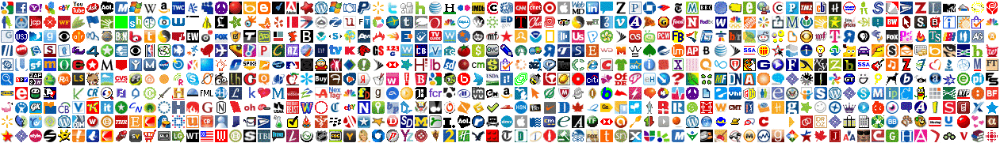

# Favorite Icons Of Internet

Art project that aims to depict the vastness and colorfullness of the internet.

You can see the result of all the crawling and image-crunching at [FavoriteIconsOfInternet.com](http://www.favoriteiconsofinternet.com/)

Our current goal is to bring the project to the state where we can keep the history of daily favicon changes for at least a million web sites.

## Processing Steps

### Step 1. [Load domains](https://github.com/Favorite-Icons-Of-Internet/Favorite-Icons-Of-Internet/issues/2)  :white_check_mark:

Updates a list of domains in the database, currently takes a list of Alexa Rankings.

Runs on central box. See [steps_1_and_2.sh](https://github.com/sergeychernyshev/Favorite-Icons-Of-Internet/blob/master/steps_1_and_2.sh)

### Step 2. [Get a list of domains to crawl](https://github.com/Favorite-Icons-Of-Internet/Favorite-Icons-Of-Internet/issues/3)  :white_check_mark:

Gets a list of domains to crawl (currently only active Alexa domains) and uploads them to a queue in chunks for crawlers to pick up

Runs on central box. See [steps_1_and_2.sh](https://github.com/sergeychernyshev/Favorite-Icons-Of-Internet/blob/master/steps_1_and_2.sh)

### Step 3. [Fetch icons](https://github.com/Favorite-Icons-Of-Internet/Favorite-Icons-Of-Internet/issues/1)  :white_check_mark:

Listens for messages in a queue and crawls the sites in the message finding favorite icons and comparing them to existing version to see if the have changed.

Runs on crawler workers. See [steps_3_and_4.sh](https://github.com/sergeychernyshev/Favorite-Icons-Of-Internet/blob/master/steps_3_and_4.sh)

### Step 4. [Convert icons to PNG](https://github.com/Favorite-Icons-Of-Internet/Favorite-Icons-Of-Internet/issues/4)  :white_check_mark:

After all icons are fetched, convert them to PNG, calculate average color and upload to results storage together with manifest describing which icons are new, which has changed and etc.

Runs on crawler workers. See [steps_3_and_4.sh](https://github.com/sergeychernyshev/Favorite-Icons-Of-Internet/blob/master/steps_3_and_4.sh)

### Step 5. [Calculate tiles to be updated](https://github.com/Favorite-Icons-Of-Internet/Favorite-Icons-Of-Internet/issues/5) :red_circle:

Gather all the results and update the database. Calculate a list of tiles that need to be updated (currently all tiles with predefined width/height ordered by Alexa ranking) and put each tile as a job into a queue.

Generate HTML and necessary JSON metadata.

Runs on central box. [TBD](https://github.com/Favorite-Icons-Of-Internet/Favorite-Icons-Of-Internet/issues/5) (To Be Developed)

### Step 6. [Generate tiles](https://github.com/Favorite-Icons-Of-Internet/Favorite-Icons-Of-Internet/issues/6) :red_circle:

Grab images required for the tile (or sync them all) and generate a tile. Optimize the image using smu.sh and deploy to a CDN.

Runs on tile workers. [TBD](https://github.com/Favorite-Icons-Of-Internet/Favorite-Icons-Of-Internet/issues/6) (To Be Developed)

### Step 7. [Move HTML and metadata to production](https://github.com/Favorite-Icons-Of-Internet/Favorite-Icons-Of-Internet/issues/7) :red_circle:

Once all tiles are done, move HTML and metadata chunks over to production!

Runs on central box. [TBD](https://github.com/Favorite-Icons-Of-Internet/Favorite-Icons-Of-Internet/issues/7) (To Be Developed)

## Step 8. [Send emails, daily reports and etc](https://github.com/Favorite-Icons-Of-Internet/Favorite-Icons-Of-Internet/issues/8) :red_circle:

Notify users (if any), send daily newsletter and etc.

Runs on central box (and SMTP workers if load is high). [TBD](https://github.com/Favorite-Icons-Of-Internet/Favorite-Icons-Of-Internet/issues/8) (To Be Developed)

